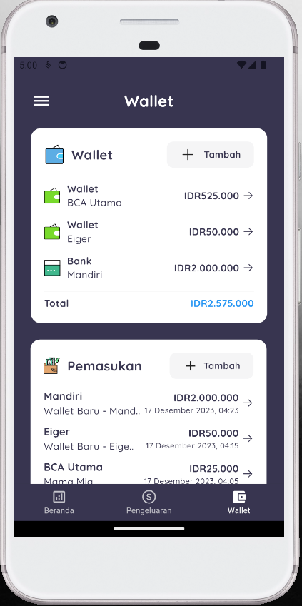
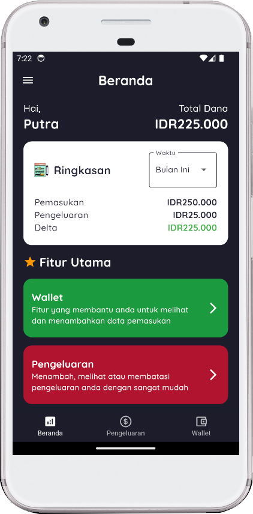

    <h1> KeuanganKu</h1>

KeuanganKu hadir sebagai platform inovatif yang dirancang khusus untuk memberikan dukungan dalam mengelola keuangan Anda secara lebih efisien. Dengan fitur-fitur andalan yang tersedia, tujuan platform ini adalah untuk memudahkan Anda dalam perencanaan, pemantauan, dan optimalisasi segala aspek keuangan Anda.

## :busts_in_silhouette: Anggota Kelompok
<table >
  <thead>
    <tr>
      <td>No</td>
      <td>NIM</td>
      <td>Nama Anggota</td>
    </tr>
  <thead>
  <tbody>
    <tr>
      <td>1</td>
      <td>15220384</td>
      <td>Derza Andreas</td>
    </tr>
    <tr>
      <td>2</td>
      <td>15220691</td>
      <td>Rifqi Abdillah Rosyad</td>
    </tr>
    <tr>
      <td>3</td>
      <td>15220515</td>
      <td>Muhammad Fajar Raihan</td>
    </tr>
    <tr>
      <td>4</td>
      <td>15220671</td>
      <td>Muhammad Dhafa Mahardika</td>
    </tr>
    <tr>
      <td>5</td>
      <td>15220257</td>
      <td>Syafiq Najwan</td>
    </tr>
    
  </tbody>
</table>

## 💻 Pengguna Sistem
Pengguna yang dapat memakai sistem ini adalah User.

## 👨‍💻 Skenario Kebutuhan Pengguna
### User
<ol>
  <li>User dapat menambahkan data seperti pengeluaran, pemasukan, dan limiter</li>
  <li>User dapat mengubah dan menghapus data pengeluaran, pemasukan, limiter dan data user</li>
</ol>

## 🖼️ Screenshot Aplikasi
<table width="100%">
  <tbody>
    <tr>
      <td width="33%">
        <h5>Wallet</h5>
         
      </td>
      <td width="33%">
        <h5>Beranda</h5>
        
      </td>
    </tr>
  </tbody>
</table>
<!-- Boleh tambahkan jumlah screenshot lebih dari 3 gambar agar lebih lengkap dalam pengenalan aplikasinya -->

## 📝 Prerequisite
Untuk menjalankan aplikasi ini disarankan untuk menyiapkan aplikasi berikut ini :
  - [x] Android Studio Giraffe <code>2022.03.1 Patch 1</code>
  - [x] Flutter <code>3.16.2</code>
  - [x] Dart <code>3.2.2</code>
  - [x] Java JDK <code>19.0.0</code>
  - [x] Git <code>2.42.1</code>

## :coffee: Credit
Project ini mengacu pada modul praktik dari mata kuliah Mobile Programming Universitas Bina Sarana Informatika (UBSI) yang diampu oleh Bpk. <a href="https://github.com/yuris60">Yuris Alkhalifi, M.Kom., CPDSA</a> selaku Dosen.
